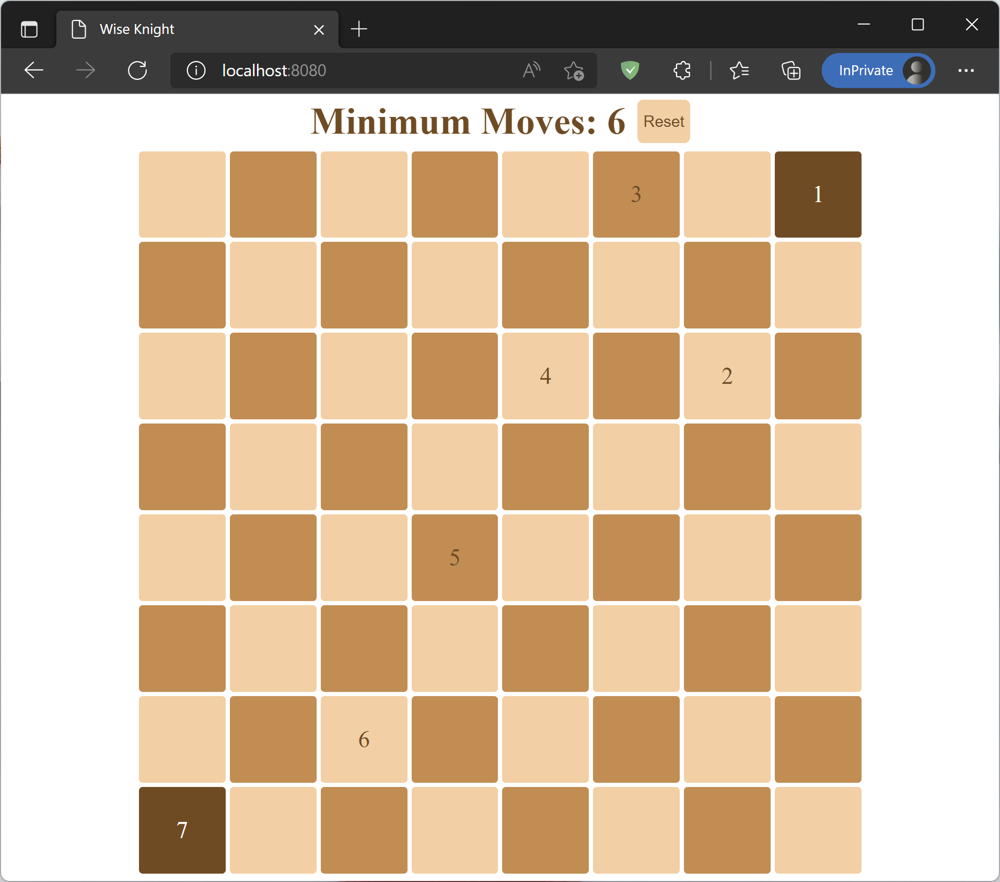

# Wise Knight

A simple app demonstrating dockerized spring boot web app.

This app calculates minimum moves a knight can go from start to end:



## Quick Start Guide

1. Install [Docker](https://docs.docker.com/engine/install/)
2. Clone this repository and `cd WiseKnight`
3. Build jar file*:
```bash
docker run -it --rm --name wise-knight-builder \
 -v "$PWD":/usr/src/app \
 -v "$HOME"/.m2:/root/.m2 \
 -w /usr/src/app \
 maven:3.8-openjdk-17 mvn clean package
```
4. Build Docker image:
```bash
docker build -t mkay1375/wise-knight:latest .
```
5. Run the app:
```bash
docker run -p 8080:8080 mkay1375/wise-knight
```
6. Head to [http://localhost:8080](http://localhost:8080)

\* Maven may not work with VPN; if you stuck on maven, disable VPN and run the command again.